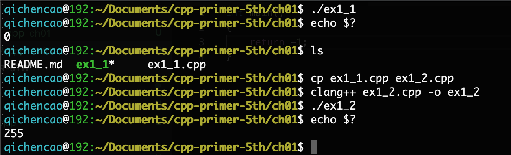

## 1.1

> 查阅你使用的编译器的文档，确定它所使用的文件命名约定。编译并运行第2页的main程序。

- [GCC and File Extensions](http://labor-liber.org/en/gnu-linux/development/index.php?diapo=extensions)
- [File Types Created for Visual C++ Projects](https://msdn.microsoft.com/en-us/library/3awe4781.aspx)
- [Clang Language Extensions](https://clang.llvm.org/docs/LanguageExtensions.html)

## 1.2

> 改写程序，让它返回-1。返回值-1通常被当做程序错误的标识。重新编译并运行你的程序，观察你的系统如何处理main返回的错误标识。



参考http://www.tldp.org/LDP/abs/html/exitcodes.html

## 1.3

> 编写程序，在标准输出上打印Hello, World。

[ex1_3.cpp](ex1_3.cpp)

## 1.4

> 我们的程序使用加法运算符+来将两个数相加。编写程序使用乘法运算符*，来打印两个数的积。

[ex1_4.cpp](ex_1.4.cpp)

## 1.5

> 我们将所有输出操作放在一条很长的语句中。重写程序，将每个运算对象的打印操作放在一条独立的语句中。

[ex1_5.cpp](ex1_5.cpp)

## 1.6

> 解释下面程序片段是否合法。
>
> ```cpp
> std::cout << "The sum of " << v1;
> 		<< " and " << v2;
> 		<< " is " << v1 + v2 << std::endl;
> ```
>
> 如果程序是合法的，它输出什么？如果程序不合法，原因何在？应该如何修正？

程序不合法，语句以分号结束，第二行和第三行的<<前都缺少表达式。

修改方法：

```cpp
std::cout << "The sun of " << v1 << " and " << v2 << " is " << v1 + v2 << std::endl;
```

## 1.7

> 编译一个包含不正确的嵌套注释的程序，观察编译器返回的错误信息。

[ex1_7.cpp](ex1_7.cpp)

```bash
qichencao@192:~/Documents/cpp-primer-5th/ch01$ clang++ ex1_7.cpp -o ex1_7
ex1_7.cpp:4:15: warning: '/*' within block comment [-Wcomment]
 * balabala.../* */
              ^
ex1_7.cpp:5:4: error: C++ requires a type specifier for all declarations
 * wrong for nested annotaion
   ^
ex1_7.cpp:5:9: error: expected ';' after top level declarator
 * wrong for nested annotaion
        ^
        ;
1 warning and 2 errors generated.
qichencao@192:~/Documents/cpp-primer-5th/ch01$ 
```

## 1.8

> 指出下列哪些输出语句是合法的（如果有的话）：
>
> ```cpp
> std::cout << "/*";
> std::cout << "*/";
> std::cout << /* "*/" */;
> std::cout << /* "*/" /* "/*" */;
> ```
>
> 预测编译这些语句会产生什么样的结果，实际编译这些语句来验证你的答案（编写一个小程序，每次将上述一条语句作为其主体），改正每个编译错误。

前两个是正确的，后两个有问题，改一下：

```cpp
std::cout << /* "*/" */";	//输出" */"
std::cout << /* "*/" /* "/*" */;//输出" /* "
```

## 1.9

> 编写程序，使用while循环将50到100的整数相加。

[ex1_9.cpp](ex1_9.cpp)

## 1.10

> 除了`++`运算符将运算对象的值增加1之外，还有一个递减运算符`--`来实现值减少1。编写程序，使用递减运算符在循环中按递减顺序打印出10到0之间的整数。

[ex1_10.cpp](ex1_10.cpp)

## 1.11

> 编写程序，提示用户输入两个整数，打印出这两个整数所指定的范围内的所有整数。

[ex1_11.cpp](ex1_11.cpp)

## 1.12

> 下面的for循环完成了什么功能？sum的终值是多少？
>
> ```cpp
> int sum = 0;
> for(int i = -100; i <= 100; ++i)
>     sum += i;
> ```
>
>

完成了-100到100之间整数的累加，sum终值是0。

## 1.13

> 使用for循环重做1.4.1节中的所有练习。

[ex1_13.cpp](ex1_13.cpp)

## 1.14

> 对比for循环和while循环，两种形式的优缺点各是什么？

stackoverflow的讨论：https://stackoverflow.com/questions/2950931/for-vs-while-in-c-programming

## 1.15

> 编写程序，包含第14页“再探编译”中讨论的常见错误。熟悉编译器生成的错误信息。

略

## 1.16

> 编写程序，从cin读取一组数，输出求和。

[ex1_16.cpp](ex1_16.cpp)

## 1.17

> 如果输入的所有值都是相等的，本节的程序会输出什么？如果没有重复值，输出又是怎样的？

如果所有输入都相等，会打印一行，输出的次数为输入的次数。

如果没有重复，则每个打印一行，次数都为1。

## 1.18

> 编译并运行本节的程序，给它输入全都相等的值。再次运行程序，输入没有重复的值。

[ex1_18.cpp](ex1_18.cpp)

## 1.19

> 修改你为1.4.1节练习1.10所编写的程序（打印一个范围内的数），使其能处理用户输入的第一个数比第二个数小的情况。

编写1.10时已经考虑到了。略。

## 1.20

在网站<http://www.informit.com/title/032174113>上，第1章的代码目录中包含了头文件Sales_item.h。将它拷贝到你自己的工作目录中。用它编写一个程序，读取一组书籍销售记录，将每条记录打印到标准输出上。

[ex1_20.cpp](ex1_20.cpp)

## 1.21

> 编写程序，读取两个ISBN相同的Sales_item对象，输出它们的和。

[ex1_21.cpp](ex1_21.cpp)

## 1.22

> 编写程序，读取多个具有相同ISBN的销售记录，输出所有记录的和。

[ex1_22.cpp](ex1_22.cpp)

## 1.23

> 编写程序，读取多条销售记录，并统计每个ISBN（每本书）有几条销售记录。

[ex1_23.cpp](ex1_23.cpp)

## 1.24

> 输入表示多个ISBN的多条销售记录来测试上一个程序，每个ISBN的记录应该聚在一起。

1.23的程序已经处理了。

## 1.25

> 借助网站上的Sales_item.h头文件，编译并运行本节给出的书店程序。

略，比起自己手写的1.23，书中示例程序更为友好。