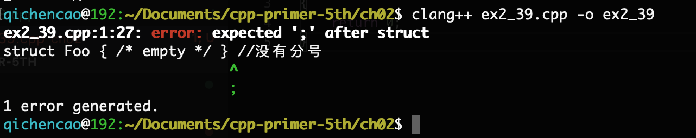

## 2.1

> 类型int、long、long long和short的区别是什么？无符号类型和带符号类型的区别是什么？float和double的区别是什么？

- [What are the criteria for choosing between short / int / long data types?](https://isocpp.org/wiki/faq/newbie#choosing-int-size)
- [Difference between float and double](http://stackoverflow.com/questions/2386772/difference-between-float-and-double)

## 2.2

> 计算按揭贷款时，对于利率、本金和付款分别应选择何种数据类型？说明你的理由。

使用double或者float。因为它们往往都不是整型数，需要精确到某一位的浮点数来表示。

## 2.3

> 读程序写结果。
>
> ```cpp
> unsigned u = 10, u2 = 42;
> std::cout << u2 - u << std::endl;
> std::cout << u - u2 << std::endl;
> 
> int i = 10, i2 = 42;
> std::cout << i2 - i << std::endl;
> std::cout << i - i2 << std::endl;
> std::cout << i - u << std::endl;
> std::cout << u - i << std::endl;
> ```

输出：

```
32
4294967264
32
-32
0
0
```

## 2.4

> 编写程序检查你的估计是否正确，如果不正确，请仔细研读本节直到弄明白问题所在。

[ex2_4.cpp](ex2_4.cpp)

## 2.5

> 指出下述字面值的数据类型并说明每一组内几种字面值的区别：
>
> (a) 'a', L'a', "a", L"a"
>
> (b)10, 10u, 10L, 10uL, 012, 0xC
>
> (c)3.14, 3.14f, 3.14L
>
> (d)10, 10u, 10., 10e-2

(a): char，wchar_t，字符串，宽字符串

(b): int，unsigned int，long，unsigned long，八进制表示的int，十六进制表示的int

(c): double，float，long double

(d): int，unsigned int，double，double的科学计数法表示

## 2.6

> 下面两组定义是否有区别，如果有，请叙述之：
>
> ```cpp
> int month = 9, day = 7;
> int month = 09, day = 07;
> ```

有区别，第二行是按八进制形式定义的int，其中month的定义是错误的，9超过了八进制可以表示的范畴，应该改为`int month = 011`。

## 2.7

> 下述字面值表示何种含义？它们各自的数据类型是什么？
>
> (a) "Who goes with F\145rgus?\012"
>
> (b) 3.14e1L	(c) 1024f		(d) 3.14L

(a): \145是八进制，展开就是64+32+5  = 101，是'e'的ASCII码。\012是10，表示换行符，因此最终表示为`Who goes with Fergus?<new line>`。类型是string。

(b): 31.4，long double

(c): 错误，f只能跟在浮点型后

(d): 3.14，double

## 2.8

> 请利用转义序列编写一段程序，要求先输出2M，然后转到新一行。修改程序使其先输出2，然后输出制表符，再输出M，最后转到新一行。

[ex2_8.cpp](ex2_8.cpp)

## 2.9

> 解释下列定义的含义。对于非法的定义，请说明错在何处并将其改正。
>
> (a) `std::cin >> int input_value;`	(b)`int i = {3.14};`
>
> (c)`double salary = wage = 9999.99;`	(d) `int i = 3.14;`

(a):错误，改为：

```cpp
int input_value;
std::cin >> input_value;
```

(b):C++11以前，会warning，表示从double到int进行了隐式转换。C++11以后，会直接报错，double类型不能作为int类型的初始值列表。

改为`double i = {3.14};`

(c):如果wage此前声明过，那么就是正确的，否则就是错误的，改为：

```cpp
double wage;
double salary = wage = 9999.99;
```

(d):正确，但是值会被截断。i为3。

## 2.10

> 下列变量的初值分别是什么？
>
> ```cpp
> std::string global_str;
> int global_int;
> int main()
> {
>     int local_int;
>     std::string local_str;
> }
> ```

global_str是""，global_int是0，local_int是未确定的，local_str是""。

## 2.11

> 指出下面的语句是声明还是定义：
>
> (a) `extern int ix = 1024;`
>
> (b) `int iy;`
>
> (c) `extern int iz;`

(a)是定义。

(b)是定义。

(c)是声明。

## 2.12

> 请指出下面的名字中哪些是非法的？
>
> (a)`int double = 3.14;`
>
> (b)`int _;`
>
> (c)`int catch-22;`
>
> (d)`int 1_or_2 = 1;`
>
> (e)`double Double = 3.14;`

a，c和d都是非法的。b和e尽管合法，但也不推荐。

## 2.13

> 下面程序中j的值是多少？
>
> ```cpp
> int i = 42;
> int main()
> {
>     int i = 100;
>     int j = i;
> }
> ```

j为100。

## 2.14

> 下面的程序合法吗？如果合法，它将输出什么？
>
> ```cpp
> int i = 100, sum = 0;
> for(int i=0;i!=10;++i)
>     sum += i；
> std::cout << i << " " << sum << std::endl;
> ```

合法，将输出`100 45`。

## 2.15

> 下面的哪个定义是不合法的？为什么？
>
> (a)`int ival = 1.01; `		(b)` int &rval1 = 1.01;`
>
> (c)`int &rval2 = ival;`	(d) `int &rval3;`

b不合法，因为引用不能绑定到字面值常量。

d不合法，引用必须初始化。

## 2.16

> 考查下面的所有赋值然后回答：哪些赋值是不合法的？为什么？哪些赋值是合法的？它们执行了什么样的操作？
>
> int i = 0, &r1= i;	double d = 0, &r2 = d;
>
> (a) r2 = 3.14159;		(b) r2 = r1;
>
> (c)i = r2;				(d)r1 = d;

都合法，a会使d变成3.14159。b会使d截断变为0。c会使i变为0。d会使i变为0。

## 2.17

> 执行下面的代码段将输出什么结果？
>
> ```cpp
> int i, &ri = i;
> i = 5; ri = 10;
> std::cout << i << " " << ri << std::endl;
> ```

会输出`10 10`。

## 2.18

> 编写代码分别更改指针的值以及指针所指对象的值。

略

## 2.19

> 说明指针和引用的主要区别。

引用只是一个对象的别名，本身不是对象，必须初始化时绑定。

指针是一个对象，保存的是指向对象的地址值。指针可以选择性初始化，也可以通过赋值操作来指向其他对象（非顶层const指针）。

## 2.20

> 请叙述下面这段代码的作用。
>
> ```cpp
> int i = 42;
> int *p1 = &i;
> *p1 = *p1 * *p1;
> ```

定义了int型i，值为42，p1指针指向i，对i进行赋值，值为42*42。

## 2.21

> 请解释下述定义。在这些定义中有非法的吗？如果有，为什么？
>
> ```cpp
> int i = 0;
> (a) double *dp = &i; (b) int *ip = i; (c) int *p = &i;
> ```

a非法，double*只能指向double类型对象；

b非法，i前面必须要加取地址符。

## 2.22

> 假设p是一个int型指针，请说明下述代码的含义。
>
> `if(p) // ...`
>
> `if(*p) // ...`

第一行：判断p是不是一个nullptr

第二行：判断p指向的内存值是不是非零

## 2.23

> 给定指针p，你能知道它是否指向了一个合法的对象吗？如果能，叙述判断的思路；如果不能，也请说明原因。

不能，因为无法判定指针所指的对象是否被释放了。此时的指针就是悬垂指针。

## 2.24

> 在下面这段代码中为什么p合法而lp非法？
>
> ```cpp
> int i = 42;
> void *p = &i;
> long *lp = &i;
> ```

因为`void*`的意义是指向未知类型的指针，是一种泛用的指针类型，而`long*`则明确表示指向的是long对象，但i是int型。

## 2.25

> 说明下列变量的类型和值。
>
> (a)` int* ip, i, &r = i; `
>
> (b) `int i, *ip = 0;`
>
> (c) `int *ip, ip2;`

(a): ip是int型指针，i是int型，r是i的引用。它们的值是不确定的。

(b): i是int型，ip是int型指针，i值不确定，ip为空指针。

(c): ip是int型指针，ip2是int型，值都不确定。

## 2.26

> 下面哪些句子是合法的？如果有不合法的句子，请说明为什么？
>
> (a) `const int buf;`	(b) `int cnt = 0;`
>
> (c) `const int sz = cnt;`	(d)` ++cnt; ++sz;`

a不合法，因为const值需要初始化。

b合法。

c合法。

d中第一句合法，第二句不合法，因为const int不能改变值。

## 2.27

> 下面的哪些初始化是合法的？请说明原因。
>
> (a)`int i = -1, &r = 0;`
>
> (b)`int *const p2 = &i2;`
>
> (c)`const int i = -1, &r = 0;`
>
> (d)`const int *const p3 = &i2;`
>
> (e)`const int *p1 = &i2;`
>
> (f)`const int &const r2;`
>
> (g)`const int i2 = i, &r = i;`

a不合法，引用r得帮到对象上而不是字面值0。

b合法。

c合法，const引用可以绑定到字面值常量。

d合法。

e不合法，引用本身不能是const的，引用的类型可以是const的。

g合法，const引用可以绑定到非const类型上，实际上编译器会临时生成一个const对象来绑定。

## 2.28

> 说明下面的这些定义是什么意思，挑出其中不合法的。
>
> (a)`int i, *const cp;`
>
> (b)`int *p1, *const p2;`
>
> (c)`const int ic, &r = ic;`
>
> (d)`const int *const p3;`
>
> (e)`const int *p;`

a不合法，指针是const的，必须初始化。

b不合法，p2必须初始化。

c不合法，ic是const，必须初始化。

d不合法，p3必须初始化。

e合法。

## 2.29

> 假设已有上一个练习中定义的那些变量，则下面的哪些语句是合法的？请说明原因。
>
> (a) `i = ic;`
>
> (b) `p1 = p3;`
>
> (c) `p1 = &ic;`
>
> (d)`p3 = &ic;`
>
> (e)`p2 = p1;`
>
> (f) `ic = *p3;`

a合法。

b不合法，p3指向的是const int，p1不能指向const int。

c不合法，ic是const int。

d不合法，p3是const指针，不能修改指向其他对象。

e不合法，p2是const指针。

f不合法，ic是const，不能对其赋值。

## 2.30

> 对于下面的这些语句，请说明对象被声明成了顶层const还是底层const?
>
> ```cpp
> const int v2 = 0;	int v1 = v2;
> int *p1 = &v1, &r1 = v1;
> const int *p2 = &v2, const p3 = &i, &r2 = v2;
> ```

v2是顶层const，v1没有。

p1没有，r1没有。

p2是底层const，p3是顶层const和底层const都有，r2是底层const。

## 2.31

> 假设已有上一个练习中所作的那些声明，则下面的哪些语句是合法的？请说明顶层const和底层const在每个例子中有何体现。
>
> ```cpp
> r1 = v2;
> p1 = p2; p2 = p1;
> p1 = p3; p2 = p3;
> ```

第一句合法，v1会被赋值为0，v2的顶层const会被忽略。

第二句不合法，p1不能指向const int型。

第三句合法。

第四句不合法，p1不能指向const int型。

第五句合法。

## 2.32

> 下面的代码是否合法？如果非法，请设法将其修改正确。
>
> `int null = 0, *p = null;`

不合法，`int null = 0, *p = &null;`

## 2.33

> 利用本节定义的变量，判断下列语句的运行结果。
>
> `a = 42; b = 42; c = 42;`
>
> `d = 42; e = 42; g = 42;`

前三个分别为a、b和c赋值为42。

d是一个int指针，赋值是错误的。

e是const int指针，赋值是错误的。

g是const int&，绑定到ci，常量不能被赋值，错误。

## 2.34

> 基于上一个练习中的变量和语句编写一段程序，输出赋值前后变量的内容，你刚才的推断正确吗？如果不对，请反复研读本节的示例直到你明白错在何处为止。

略。

## 2.35

> 判断下列定义推断出的类型是什么，然后编写程序进行验证。
>
> ```cpp
> const int i = 42;
> auto j = i; const auto &k = i; auto *p = &i;
> const auto j2 = i, &k2 = i;
> ```

j是int型，顶层const会被忽略。k是const int&，p是const int*。

j2是const int，k2是const int&。

## 2.36

> 关于下面的代码，请指出每一个变量的类型以及程序结束时它们各自的值。
>
> ```cpp
> int a = 3, b = 4;
> decltype(a) c = a;
> decltype((b)) d = a;
> ++c;
> ++d;
> ```

c是int型，d是int&，绑定到a。

（这是因为decltype如果作用于表达式，则如果表达式的值是一个左值，则返回左值引用）

执行后，a、b、c、d都是4。

## 2.37

> 赋值是会产生引用的一类典型表达式，引用的类型就是左值的类型。也就是说，如果i是int，则表达式i=x的类型是int&。根据这一特点，请指出下面的代码中每一个变量的类型和值。
>
> ```cpp
> int a = 3, b = 4;
> decltype(a) c = a;
> decltype(a = b) d = a;
> ```

c是int型，值为3。d是int&，绑定到a，值为3。

## 2.38

> 说明由decltype指定类型和由auto指定类型有何区别。请举出一个例子，decltype指定的类型与auto指定的类型一样；再举一个例子，decltype指定的类型和auto指定的类型不一样。

decltype对顶层const和引用的处理与auto不同，auto会忽略而decltype不会忽略。

decltype作用于表达式时，如果值为左值，则返回左值引用。

```cpp
int i = 0, &r = i;
// same
auto a = i;
decltype(i) b = i;
// different
auto c = r;			//c为int
decltype(r) d = r;	//d为int&，绑定到i
```

## 2.39

> 编译下面的程序观察其运行结果，注意，如果忘记写类定义体后面的分号会发生什么情况？记录下相关信息，以后可能会有用。
>
> ```cpp
> struct Foo { /* empty */ } //没有分号
> int main()
> {
>     return 0;
> }
> ```



## 2.40

> 根据自己的理解写出Sales_data类，最好与书中的例子有所区别。

```cpp
struct Sales_data
{
    std::string bookNo;
    unsigned int units_sold = 0;
    double revenue = 0.0;
};
```

## 2.41

> 使用你自己的Sales_data类重写1.5.1节、1.5.2节和1.6节的联系。眼下先把Sales_data类的定义和main函数放在同一个文件里。

这题目放这里没啥意义，略。

## 2.42

> 根据你自己的理解重写一个Sales_data.h头文件，并以此为基础重做2.6.2节的练习。

同上，略。

