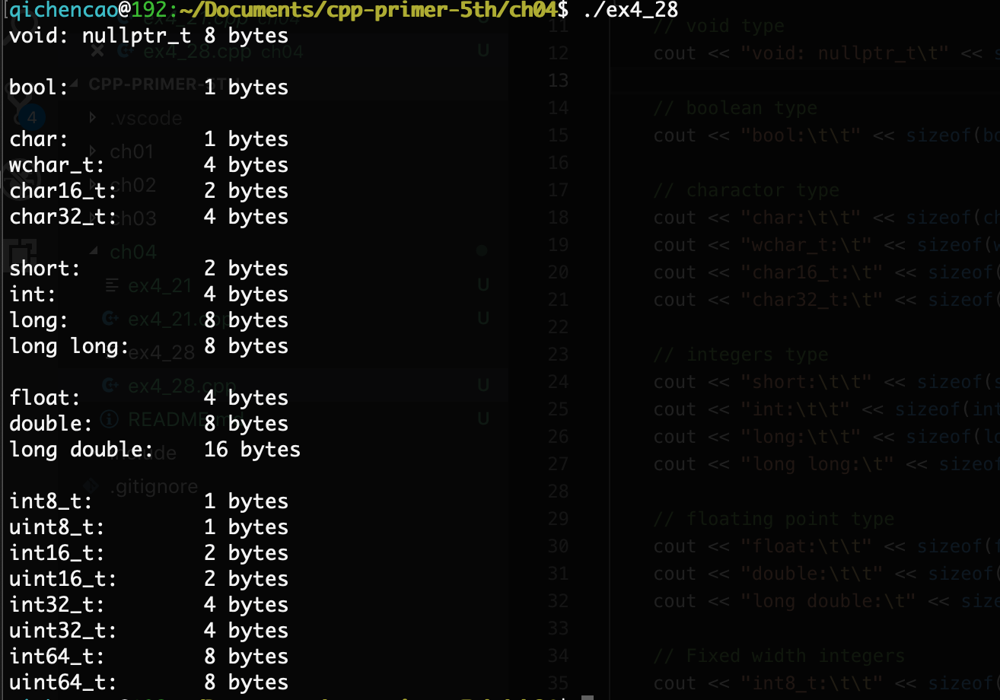

## 4.1

> 表达式5+10*20/2的求值结果是多少？

105

## 4.2

> 根据4.12节中的表，在下述表达式的合理位置添加括号，使得添加括号后运算对象的组合顺序与添加括号前一致。
>
> (a)`*vec.begin()` (b)`*vec.begin() + 1`

(a)`*(vec.begin())`

(b)`(*(vec.begin())) + 1`

## 4.3

> C++语言没有明确规定大多数二元运算符的求值顺序，给编译器优化留下了余地。这种策略实际上是在代码生成效率和程序潜在缺陷之间进行了权衡，你认为这可以接受吗？请说出你的理由。

这要看优化带来的性能提升是否可观，如果可观则可以接受，否则它引起的更多潜在bug会更惹人厌。

## 4.4

> 在下面的表达式中添加括号，说明其求值的过程及最终结果。编写程序编译该（不加括号的）表达式并输出其结果验证之前的推断。
>
> `12 / 3 * 4 + 5 * 15 + 24 % 4 / 2`

`((12/3)*4)+(5*15)+((24%4)/2)`

91

## 4.5

> 写出下列表达式的求值结果。
>
> (a)`-30 * 3 + 21 / 5`
>
> (b)`-30 + 3 * 21 / 5`
>
> (c)`30 / 3 * 21 % 5`
>
> (d)`-30 / 3 * 21 % 4`

(a): -86		(b)-18	(c)0		(d)-2

## 4.6

> 写出一条表达式用于确定一个整数是奇数还是偶数。

n % 2 == 0

## 4.7

> 溢出是何含义？写出三条将导致溢出的表达式。

溢出就是值超过了所能表示的范围。

```cpp
short s = 32767; ++s;
unsigned short us = 65535; ++us;
unsigned short us2 = 0; --us2;
```

## 4.8

>说明在逻辑与、 逻辑或及相等性运算符中运算对象求值的顺序。

逻辑与和逻辑或都有短路效应。逻辑与会先计算左边表达式，仅在左边表达式为真时才继续执行右侧表达式。逻辑或则先计算左边表达式，仅在左边表达式为假时才继续执行右侧表达式。

==则没有定义求值顺序。

## 4.9

> 解释在下面的if语句中条件部分的判断过程。
>
> ```cpp
> const char *cp = "Hello World";
> if(cp && *cp)
> ```

先判断cp是否是空指针，如果不是则对cp解引用，判断"Hello World"的第一个字符是不是终结符''\0'。

## 4.10

> 为while循环写一个条件，使其从标准输入中读取整数，遇到42时停止。

```cpp
int i;
while(cin >> i && i != 42)
```

## 4.11

> 书写一条表达式用于测试4个值a、b、c、d的关系，确保a大于b、b大于c、c大于d。

`a > b && b > c && c > d`

## 4.12

> 假设i、j和k是三个整数，说明表达式i != j < k的含义。

等同于`i != (j < k)`

## 4.13

> 在下述语句中，当赋值完成后i和d的值分别是多少？
>
> ```cpp
> int i; double d;
> (a)d = i = 3.5;	(b)i = d = 3.5;
> ```

(a)i是3，d是3.0

(b)i是3，d是3.5

## 4.14

> 执行下述if语句后将发生什么情况？
>
> ```cpp
> if(42 = i)	// ...
> if(i = 42) 	// ...
> ```

第一个会报错，右值不能被赋值，第二个会通过编译，运行时if条件始终为真。

## 4.15

> 下面的赋值是非法的，为什么？应该如何修改？
>
> ```cpp
> double dval; int ival; int *pi;
> dval = ival = pi = 0;
> ```


pi是指针，不能把pi赋值给int类型（第二个等号有错误）。

改成`dval = ival = 0; pi = nullptr;`（`pi = 0;`也可以，不推荐）。

## 4.16

> 尽管下面的语句合法，但它们实际执行的行为可能和预期并不一样，为什么？应该如何修改？
>
> (a)`if(p = getPtr() != 0)`		(b)`if(i = 1024)`

(a)赋值运算符优先级低于比较运算符，改为`if((p = getPtr()) != 0)`。

(b)改为`if(i == 1024)`。

## 4.17

> 说明前置递增运算符和后置递增运算符的区别。

前置递增运算符返回自增后对象的引用，后置递增运算符返回自增前对象的副本。

## 4.18

> 如果第132页那个输出vector对象元素的while循环使用前置递增运算符，将得到什么结果？

会从第二个元素开始打印，如果有负值会输出第一个负值，如果没有会解引用v.end()。

## 4.19

>假设ptr的类型是指向int的指针、vec的类型是`vector<int>`、ival的类型是int，说明下面的表达式是何含义？如果有表达式不正确，为什么？应该如何修改？
>
>(a)`ptr != 0 && *ptr++`
>
>(b)`ival++ && ival`
>
>(c)`vec[ival++] <= vec[ival]`

(a): ptr是否为空？如果不为空，则检查ptr指向的int是否为0。表达式执行后，ptr会向后移动一个单位。

(b): 检查ival是否为0，如果不为0则继续检查ival+1是否为0。

(c): 错误。未定义的行为，可能引起二义（自杀式写法）。改为`vec[ival] <= vec[ival+1]`。

## 4.20

> 假设iter的类型是`vector<string>::iterator`，说明下面的表达式是否合法。如果合法，表达式的含义是什么？如果不合法，错在何处？
>
> (a)`*iter++;`	(b)`(*iter)++;`	(c)`*iter.empty()`
>
> (d)`iter->empty()`	(e)`++*iter;`	(f)`iter++->empty();`

(a)合法，解引用iter，然后iter向后移动一个单位。

(b)不合法，*iter是个string，不支持自增运算符。

(c)不合法，`.`优先级高于`*`，`(*iter).empty()`

(d)合法，检查iter指向的string是否为空串。

(e)不合法，结合律问题，*iter先执行，string不能自增。

(f)合法，返回iter->empty()，此后iter自增。

## 4.21

> 编写一段程序，使用条件运算符从`vector<int>`中找到哪些元素的值是奇数，然后将这些奇数值翻倍。

[ex4_21.cpp](ex4_21.cpp)

## 4.22

> 本节的示例程序将成绩划分成high pass、pass和fail三种，扩展该程序使其进一步将60分到75分之间的成绩设定为low pass。要求程序包含两个版本：一个版本只使用条件运算符；另外一个版本使用1个或多个if语句。哪个版本的程序更容易理解呢？为什么？

程序略。

if语句更易读。但其实条件运算符习惯了也很易读。

## 4.23

> 因为运算符的优先级问题，下面这条表达式无法通过编译。根据4.12节中的表(第147页)指出它的问题在哪里？应该如何修改？
>
> ```cpp
> string s = "word";
> string p1 = s + s[s.size() - 1] == 's' ? "" : "s";
> ```

算术运算符优先级高于关系运算符，因此要加括号：

`string p1 = s + (s[s.size()-1] == 's' ? "" + "s");`

## 4.24

> 本节的示例程序将成绩划分成high pass、pass和fail三种，它的依据是条件运算符满足右结合律。假如条件运算符满足的是左结合律，求值过程将是怎样的？

略，此题无意义。

## 4.25

> 如果一台机器上int占32位、char占8位，用的是Latin-1字符集，其中字符'q'的二进制形式是01110001，那么表达式`~'q'<<6`的值是什么？

-7296

## 4.26

> 在本节关于测验成绩的例子中，如果使用unsigned int作为quiz1的类型会发生什么情况？

略

## 4.27

> 下列表达式的结果是什么？
>
> `unsigned long ul1 = 3, ul2 = 7;`
>
> (a)`ul1 & ul2`
>
> (b)`ul1 | ul2`
>
> (c)`ul1 && ul2`
>
> (d)`ul1 || ul2`

(a)3

(b)7

(c)true

(d)true

## 4.28

> 编写一段程序，输出每一种内置类型所占空间的大小。

[ex4_28.cpp](ex4_28.cpp)



## 4.29

> 推断下面代码的输出结果并说明理由。实际运行这段程序，结果和你想象的一样吗？如果不一样，为什么？
>
> ```cpp
> int x[10]; int *p = x;
> cout << sizeof(x)/sizeof(*x) << endl;
> cout << sizeof(p)/sizeof(*p) << endl;
> ```

第一行输出10，第二行在我的机器上输出1，但标准定义是不确定的。

## 4.30

> 根据4.12节中的表，在下述表达式的适当位置加上括号，使得加上括号之后表达式的含义与原来的含义相同。
>
> (a)`sizeof x + y`
>
> (b) `sizeof p->mem[i]`
>
> (c)`sizeof a < b`
>
> (d)`sizeof f()`

(a)sizeof优先级高于+，所以是`sizeof(x) + y`

(b)->和[]优先级更高，所以是`sizeof(p->mem[i])`

(c)sizeof优先级高于<，所以是`sizeof(a) < b`

(d)如果f()返回void，表达式未定义，否则就是返回类型的尺寸`sizeof(f())`

## 4.31

> 本节的程序使用了前置版本的递增运算符和递减运算符，解释为什么要用前置版本而不用后置版本。要想使用后置版本的递增递减运算符需要做哪些改动？使用后置版本重写本节的程序。

因为C++有一条潜规则，尽量使用前置运算符，当必须用后置时在用后置。

改写一下：

```cpp
for(vector<int>::size_type ix = 0; ix != ivec.size(); ix++, cnt--)
    ivec[ix] = cnt;
```

对这个例子来说体现不出前置和后置的差异，因为ix++始终是在循环体执行后才执行的。

## 4.32

> 解释下面这个循环的含义。
>
> ```cpp
> constexpr int size = 5;
> int ia[size] = {1,2,3,4,5};
> for(int *ptr = ia, ix=0; ix != size && ptr != ia+size; ++ix, ++ptr)
> {/* ... */}
> ```

正向循环处理数组ia的所有元素，这里ptr和ix的效果相同，没必要二者同时作用，冗余。

## 4.33

> 根据4.12节中的表说明下面这条表达式的含义。
>
> `someValue ? ++x, ++y : --x, --y`

逗号语法的一个坑，因为优先级的问题，该表达式实际上相当于:`(someValue ? ++x, ++y : --x), --y`

## 4.34

> 根据本节给出的变量定义，说明在下面的表达式中将发生什么样的类型准换：
>
> (a)`if(fval)`
>
> (b)`dval = fval + ival;`
>
> (c)`dval + ival * cval;`
>
> 需要注意每种运算符遵循的是左结合律还是右结合律。

(a)fval转成bool

(b)ival转成fval，相加后的结果再转为double

(c)cval转为int，ival*cval的结果再转为double

## 4.35

> 假设有如下的定义，
>
> ```cpp
> char cval;	int ival;	unsigned int ui;
> float fval;	double dval;
> ```
>
> 请回答在下面的表达式中发生了隐式类型转换吗？如果有，指出来。
>
> (a)`cval = 'a' + 3;`
>
> (b)`fval= ui - ival * 1.0;`
>
> (c)`dval = ui * fval;`
>
> (d)`cval = ival + fval + dval;`

(a)发生了，'a'转为了int，加3以后结果又转为了char。

(b)发生了，ival先转为double，然后ui转为double，相减后的结果再转为float。

(c)发生了，ui转为float，相乘的结果再转为double。

(d)发生了，ival转为float，与fval相加的结果再转为double，最后与dval相加的结果再转为char。

## 4.36

> 假设i是int类型，d是double类型，书写表达式`i *= d`使其执行整数类型的乘法而非浮点类型的乘法。

`i *= static_cast<int>(d);`

## 4.37

> 用命名的强制类型转换改写下列旧式的转换语句。
>
> ```cpp
> int i; double d; const string *ps; char *pc; void *pv;
> ```
>
> (a)`pv = (void*)ps;`
>
> (b)`i = int(*pc);`
>
> (c)`pv = &d;`
>
> (d)`pc = (char*)pv;`

(a)`pv = static_cast<void*>(const_cast<string*>(ps));`

(b)`i = static_cast<int>(*pc);`

(c)`pv = static_cast<void*>(&d);`

(d)`pc = static_cast<char*>(pv);`

## 4.38

> 说明下面这条表达式的含义。
>
> `double slope = static_cast<double>(j/i);`

将`j/i`的结果转换为double类型，赋值给slope。


